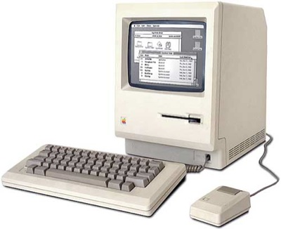
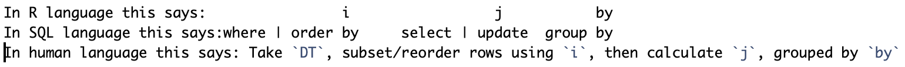

*To complete this tutorial you will need R and RStudio installed on your machine*


##How do I know if my data are big? 
*Based on [Big Data 2015 Columbia](http://www.columbia.edu/~sjm2186/EPIC_R/EPIC_R_BigData.pdf)*

* R doesn't work
* Data don't load into memory
* Analyzing data takes a really long time
* Messy visualizations


Whether or not your data are 'big data' is a subjective assessment. If you're working on a classic Macintosh 512K from the 80s (see below) with 512 KB of RAM, 1 MB of data is HUGE DATA (like, too huge for the OS huge). Alternatively, when I tell my data science friends I work with 'big data' with 20 million rows, they scoff and say "psh, that's nothing." Regardless of the size of the data you work with, it can be fruitful to spend some time thinking about how big your data are, how many data your setup can handle, and how to manage and share files and code efficiently to speed up analyses and make R work better in general. 

#

##Why does big data present challenges in the first place? 
It's big! (Four v's of big data: Volume, Velocity, Veracity, and Variety). When working in R, the biggest limitation is your random access memory (RAM). R (unlike other statistical software such as SAS) loads all data into the memory (this is your global environment, typically in the top right in RStudio). However, this environment can fill up quickly when you're developing code. It's easy to exhaust RAM with unnecessary data. 

Good practice recommendations:

* When you close out RStudio, it will ask if you want to save your environment. Please don't do this. Instead, save important objects at the end of a session (i.e. `save(object, file = "object.Rdata")`) to your repository (if your project is integrated with GitHub) or a well organized folder system. I typically nest 'raw_data' and 'manipulated_data' folders into my project folder to help stay organized. Saving your environment can make it impossible to re-open an R project.
* Consider breaking up a long script into multiple smaller scripts. End each of these with a `save()`. Begin the next script in the sequence with necessary `load()`s. This avoids having 10  versions of your dataset taking up precious memory in your environment. 
* If you do end up with 10 versions of your data set in a R session but want to stay in the session, consider using `rm()` to get rid of large objects you don't need any more.
* *NB for GitHub users: GitHub will not allow you to push files that are larger than 100 MB. If you have data files larger than this, you can keep them in the repository folder locally if you add their names to your `.gitignore` file in order to avoid errors and subsequent merge conflicts. Just remember, that if you want to share code and data with friends, they will need the GitHub repository link in addition to a link to the data files included in your `.gitignore`. Good options at Rutgers are Box and Google Drive.*

##A combination of your computer specs and R version set the amount of data your system can comfortably handle

What version of R should I be using? Ideally, you're using 64-bit because you're capped at ~ 3.5 Gb RAM with 32-bit (this is low). However, you can only use 64-bit if your computer is 64-bit. Unless you're running an older computer, you are likely running a 64-bit machine. What is this bit business anyway? 64-bit processors can swallow and digest larger chunks of data with each bite. How to know what type of processor you have?

 * Windows: Check [here.](https://helpx.adobe.com/x-productkb/global/determine-whether-computer-running-32.html)
 * Mac: All computers released since July 2012 are 64-bit. For older computers, see [here.](https://support.apple.com/en-us/HT201948)
 * Linux: See [here.](http://www.howtogeek.com/198615/how-to-check-if-your-linux-system-is-32-bit-or-64-bit/)
 
Compare this to the info you get from running the `sessionInfo()` function in R. If your computer is 64-bit, and your R version is 32-bit, download the 64-bit version! 
```{r 32-bit or 64-bit, echo = T, results = 'hide'}
sessionInfo()
```

Another step to take if you encounter problems with analyses (most often the dreaded `Error: vector memory exhausted (limit reached?)`), is to reallocate more of your memory to R. I can't offer too much guidance as I've never needed to do this. Techniques for how to do this depend on your operating system, so if you want to explore this option, I suggest a Google search of "How to reallocate more memory to R in *(Linux, Macintosh, Windows)". Take caution though, as re-allocating pre-assigned memory can cause your computer to crash if not done correctly. 

*************
##`data.table` package in R

Whether or not you have 'big data,' the `data.table` package is a super useful package to efficiently manipulate and aggregate data. It is an extension to the base R `data.frame` package. It performs similar tasks to `dplyr` and `tidyr` from tidyverse, but more efficiently (although slightly less intuitively). 

`data.table`...

* Is good for large data files
* Behaves like a data frame (functions that accept DF work for DT as well)
* Can quickly subset, group, update, and join
* Easily turns DF into DT

By the end of this tutorial, you will be able to:

* Load large CSVs fast using `fread`
* Understand and apply `data.table` syntax
* See how long an operation takes to complete
* Assign by reference
* Efficiently perform join and group by operations
* Set keys to manipulate large data sets even quicker

*NB: throughout this tutorial I will use DT as shorthand for data table and DF as shorthand for data frame. 

```{r setup install/load data.table}
#install.packages("data.table") #unhash this if you have not yet installed data.table package
library(data.table)

#also loading tidyverse for comparisons
library(tidyverse)

```

To start off, let's load a CSV. To begin to build the narrative of "`data.table` is wicked fast," we will make a giant matrix and then save it as a giant CSV. We will then read it into R both as a DF and a DT and compare system time for each way of reading the csv. We use the `system.time()` function to see how long it takes for an operation to complete.

```{r import CSV speed comparison, echo = T, results = 'hide'}
# Create a large .csv file
set.seed(100) #initiate random sampling at 100
m <- data.frame(matrix( #make a data frame from a matrix
                        runif(10000000), #runif() samples from a uniform distribution, we want to include 10 M values between 0,1 in our matrix
                        nrow=1000000)) #our matrix has 1 M rows, which means it has 10 M/1 M = 10 columns 

write.csv(m, 'm2.csv', row.names = F) #save this csv

# Time taken by read.csv (base R)  to import
system.time({m_df <- read.csv('m2.csv')}) #loading csv using read.csv() into data frame. actual time will vary by computer, by I listed my results below. You could cook an egg in the time this takes...
 #user    system  elapsed 
 #42.642   1.122  48.170 

# Time taken by read_csv() (from tidyverse) to import csv into data frame.
system.time({m_df <- read_csv('m2.csv')})
   #user  system elapsed 
  #4.067   1.289   6.049  

# Time taken by fread() (data.table) to import csv into data table.
system.time({m_dt <- fread('m2.csv')})
   #user  system elapsed 
  #0.550   0.249   1.181 

#FYI: 'user time' is CPU (central processing unit) time to execute process; 'system time' is the CPU time charged for execution by the system on behalf of the current process (opening files, etc.); 'elapsed time' is wall clock time, what did you experience?

#You may have also noticed that it took a while to write the csv to begin with. Data table has an answer to this too
system.time(write.csv(m, 'm2.csv')) #save this csv a second time using base R
#   user  system elapsed 
# 12.754   0.962  14.768 
system.time(write_csv(m, 'm2.csv')) #save this csv using tidyverse
#   user  system elapsed 
#  2.459   0.562   1.347 
system.time(fwrite(m, 'm2.csv')) #save this csv using data.table
#   user  system elapsed 
#  1.616   0.292   2.234 

#No need to actually save that rather large csv, so let's delete it from our computer
file.remove('m2.csv')

#Let's also clear up our global environment while we're at it (always here to open up memory!)
rm(m, m_df, m_dt)
```

Wow! Using data.table::fread() was ~80x faster than read.csv() from base R, and ~8x faster than read_csv() from the tidyverse. Hopefully you are now starting to believe me when I say `data.table` is the queen of big data.

###Converting DFs to DTs
You can convert any DF into a DT using:

* `data.table()` : makes a new object from a data frame or list, and leaves the original data frame or list in your environment
* `as.data.table()`: makes a new object of alternate structure, and leaves the original object (not a data frame or list) in your environment
* `setDF()`: converts DF to DT in place, you won't have to assign DT to new object. If you plan to delete the original data frame anyway, this function saves you a step.

*To play around with `data.table` we will use data on Boston Housing from the [`mlbench` package](https://cran.r-project.org/web/packages/mlbench/index.html). Each row gives statistics about a census tract from 1970 Boston census. 

```{r converting DF to DT, echo = T, results = 'hide'}

#install.packages("mlbench") #unhash if you don't have this package yet
library(mlbench) #load package to access data

data("BostonHousing2") #BostonHousing2 is a data frame within mlbench (library(help = "mlbench") to see all datasets in this package)
?BostonHousing2 #to see what column names mean

#NB: data tables CANNOT have row names, so if your data frame has row names, be sure to make these into a column before converting to a data table. (this data frame doesn't have row names, so we're good to go)

bostonhousing_dt <- as.data.table(BostonHousing2) #using this function keeps the original data frame

#alternatively, I could use setDT() to convert BostonHousing2 into a data table, replacing the original data frame

#Now, let's see what class of object our new bostonhousing_dt is...

class(bostonhousing_dt)

#Our new object is both a data.table and data.frame, and therefore, any functions we use on data frames we can still use on our data.table. However, we now have a whole new suite of functions we can use on our data.table that we could NOT use on our O.G. data frame BostonHousing2

#another handy trick about data.table is that when you view a data.table and the # of rows exceeds the global option (100 rows), it automatically prints the first 5 and last 5 rows. this is a major yet underrated perk over data frames. Copy and paste names into your console to try it out! (Will look the same in this markdown script)
BostonHousing2
bostonhousing_dt
```

###How exactly are data tables different than data frames? 
The syntax for `data.tables` is more similar to SQL. (Structured Query Language is a standardized programming language that's used to manage relational databases)

####The general form:
**DT[i, j, by]**

#

*Text below will be ugly in markdown, but I was too lazy to figure out how to get spacing to transfer... see image above.*
In R language this says:               i              j           by
In SQL language this says:where |order by   select | update group by
In human language this says: Take `DT`, subset/reorder rows using `i`, then calculate `j`, grouped by `by`


Subsetting rows using `i`. **DT[i, j, by]**
```{r subsetting rows, echo = T, results = 'hide'}
#unlike in DFs, we do NOT need to prefix column names with DT$, rather they can be called as variables

# I want rows where home is in Boston Back Bay and it bounds Charles River
bostonhousing_dt[town == "Boston Back Bay" & chas == "1",] #this function works with or without the final comma (try it out for yourself), but using DFs, you would NEED both bostonhousing_dt$ AND the comma

#note that this operation above didn't actually save a new data table. To save a subsetted data table, you would have to assign it to an object. See the following example...

#we can also use use row indices to subset rows
first <- bostonhousing_dt[1:3] #get first 3 rows (again, with or without comma, here I did without)

#above, there is no 'j' or 'by' condition, just a condition for 'i' **DT[i, j, by]**
```

We can use `data.table` to quickly sort rows using `data.table::order()` which is faster than `base::order().`
```{r sorting rows, echo = T, results = 'hide'}
#sort bostonhousing_dt by ascending number of rooms per dwelling, and then by descending property tax rate
ans <- bostonhousing_dt[order(rm, -tax)]
```

Selecting columns in `j`. **DT[i, j, by]**
```{r selecting columns using j, echo = T, results = 'hide'}
bostonhousing_dt[,age] #unlike DFs, no need for quotes! We wanted all the rows, so we skipped `i`, and began with a comma (similar to data frame syntax). Note this function returns a vector, but does not save it as an object.

#But I want a data table! Then, we have to wrap the variable in a list.
bostonhousing_dt[,list(age)]

#We can also use .() as the list wrapper. Same function, fewer keystrokes = win
bostonhousing_dt[,.(age)]

#what about multiple columns? `data.table` has you covered.
bostonhousing_dt[,.(dis, b, medv)]


```

In addition to *selecting* columns, we can use 'j' to *compute* on columns. **DT[i, j, by]**

What if we wanted to see how many rows satisfy a condition based on column values?

```{r compute with j, echo = T, results = 'hide'}
#How many census tracts have a median value of owner-occupied homes greater than $20,000 in 1970?
bostonhousing_dt[, sum((cmedv*1000 ) > 20000)]

```

We can use `data.table` to create a new column from existing columns.

```{r new columns from existing, echo = T, results = 'hide'}
bostonhousing_dt[, lstat_b := lstat * b] # := is the assignment by reference symbol in data table

#multiple new columns at once, use ':=' (note quotes)
bostonhousing_dt[,  `:=`(lstat_ptratio = lstat * ptratio,
                         lstat_age = lstat * age)]

#We can also use assignment by reference to replace values conditionally **DT[i, j, by]**
bostonhousing_dt[age >= 90, cmedv := 0][order(-age)] #if more than 90% of owner-occupied units in census tract were built before 1940, set the corrected median value of owner-occupied homes to 0
#note that you can also include more than one operation per line of code. Here, we reassigned values for cmedv dependent on age in the first bracket, and then reordered the data table in the second bracket

#We can also assign values unique to subsets **DT[i, j, by]**
bostonhousing_dt[, age_rms := mean(age), by = rm] #Assign avg age for tracts grouped by avg number of rooms in homes to each row

```

Can we delete this column we just made?
```{r delete column, echo = T, results = 'hide'}
#for sure!
bostonhousing_dt[, age_rms := NULL]
```

One unique aspect of `data.table` is that you can modify data tables without making a new object. This modification will also occur in any objects made from that original data table. Often this is helpful. However, sometimes you don't want to modify the original object, or for linked modifications to occur. In this case, we must use the `copy()` function. Any subsequent update by reference operations performed on the copied object will not affect the original object. 

```{r copy to not rewrite original, echo = T, results = 'hide'}
bostonhousing_dt_n <- names(bostonhousing_dt)
bostonhousing_dt_n

## add a new column by reference
bostonhousing_dt[, z := 3L] #L tells R we want this to be an integer column, not a numeric (double) column

## bostonhousing_dt_n also gets updated
bostonhousing_dt_n

## use `copy()`
bostonhousing_dt_n <- copy(names(bostonhousing_dt))
bostonhousing_dt[, w := 4L]

## now, bostonhousing_dt_n doesn't get updated
bostonhousing_dt_n


```


Grouping in data.table
```{r grouping, echo = T, results = 'hide'}
#Mean pupil-teacher ratio by avg number of rooms in census tract
bostonhousing_dt[, .(mean_ptratio = mean(ptratio)), by = rm] #we want to know the mean value for mileage across each cylinder group

#Multiple grouping factors? No problem!
bostonhousing_dt[, .(mean_ptratio = mean(ptratio)), by = .(rad, tax)] #here, we want to know the mean pupil-teacher ratio for each possible combination of index of accessibility to radial highways and property-tax rate

#by can also accept expressions
#How many census tracts have an avg # of rooms > 4 and > 50% of homes that were built before 1940? 
bostonhousing_dt[, .N, .(rm > 4, age > 50)]

```

We can also subset in `i` (rows), and then do/compute in `j` (columns)
```{r subset rows compute columns, echo = T, results = 'hide'}
#For census tracts with crime rates per capita below .1 that are on the Charles, what's the mean percentage of lower status of population and pupil teacher ratio?
bostonhousing_dt[crim < 0.1 & chas == 1, .(m_lstat = mean(lstat), m_ptratio = mean(ptratio))] 

```
Because the three main components of the query (i, j and by) are together inside [...], `data.table` can see all three and optimise the query altogether before evaluation, not each separately. By subsetting only for `crim` and `chas`, we improve speed and memory efficiency.

**.N and .I are your funny looking `data.table` friends**

* .N is an integer containing the number of rows in a group. If no groups are specified, it defaults to all rows in your DT. 
* .I is used as an index, for each item it holds the item's row location

```{r .N and .I, echo = T, results = 'hide'}
#How many census tracts are there on and off the Charles River?
bostonhousing_dt[, .N, by = chas]

bostonhousing_dt[, .I] #using .I, we find out that we have 506 census tracts (rows) in total

#What if I want to know all row #s where nitric oxide concentrations are above 0.5 parts per 10 million??

bostonhousing_dt[, .I[nox > 0.5]] #.I is a vector representing the rows that have NOX > 0.5 in the original dataset

bostonhousing_dt[nox > 0.5, .I] #.I is a vector representing the rows that have 6 cylinders in the NEWLY subsetted data (subsetted, and found row numbers in this one line, however this doesn't give us much useful information because we subsetted first, and therefore all rows satisfy condition)

summary(bostonhousing_dt$nox)
```

Chaining is really the bread and butter of the streamlining possible when coding with data tables. You can perform multiple `data.table` operations one after the other without having to store the intermediate results. This is really helpful when you're working with big data!
```{r chaining, echo = T, results = 'hide'}
#take multiple means grouped by town (first bracket), and then put rows produced in ascending order by # town (second bracket)
output <- bostonhousing_dt[, .(mean_rm=mean(rm), #mean average number of rooms per dwelling
                     mean_nox=mean(nox), #mean nitric oxides concentration 
                     mean_age=mean(age), #mean proportion of owner-occupied units built prior to 1940
                     mean_rad=mean(rad)), by=town][order(town), ] # mean index of accessibility to radial highways
```

Our next goal is to compute the mean of all the variables grouped by 'town.' Here, that may be managable to type it all out, but, alternatively we can write a function. To write functions within a data.table bracket, we use `lapply()` and .SD. `laaply()` applies a function over a list or vector. What about the .SD object? .SD is a data.table that contains **S**ubsets of x's **D**ata for each group EXCEPT the column specified in 'by' argument. 

```{r .SD example, echo = T, results = 'hide'}
bostonhousing_dt[, .SD, by = town]

#we can now pass this as the first argument in `lapply()`.

output <- bostonhousing_dt[, lapply(.SD, mean), by = town]

#I get an error here, because I can't take the mean of a factor (chas is classified as a factor)
class(bostonhousing_dt$chas) #check this using class() function

#We need a slightly reduced subset of column means to exclude chas, so we use the .SDCols object. '.SDCols' can accept names or indices.

output <- bostonhousing_dt[, #all rows
                    lapply(.SD, mean), #compute the mean
                    by=town, #for every cylinder count
                    .SDcols=-c("chas")] #for all columns EXCEPT 'chas' (note minus sign can be used to exclude)

```

Using 'keys' in data table allows us to perform binary searches which are faster than linear/vector scan searches. Therefore, any filtering operation runs faster after 'keys' are set.

What is a binary search?

  * Let's say we have a vector of sorted integers. 
  `1,2,3,4,5,87,90,100,1000`
  *  We want to find the value of 100
  *  We KNOW the data are sorted in ascending order, so we can do a binary search
  *  We start with the middle value, 5; Is 100 > or < 5?; Greater than, so we move our search to 5:1000
  *  Again, take middle value, this time 90; Is 100 > or < 90?; Greater than, so we move our search to 90:1000; etc. 
  *  We arrive at 100 
  *  Using a linear search, we would have had to scan through all numbers and create a huge logical vector of 'T', 'F' to get to 100

Keys:

  * physically reorder rows by the columns provided by the key, in increasing order
  * marks key columns by setting attribute called `sorted` to `data.table`

```{r setting keys, echo = T, results = 'hide'}
setkey(bostonhousing_dt, tract) #internally sorts bostonhousing_dt by tract

#hmmm, what if you already forgot if you have set a key?

key(bostonhousing_dt)

#ahh, okay. I remember now.

#setting keys makes allows for highly efficient merges
dt1 <- bostonhousing_dt[,.(tract, town, b)]
dt2 <- bostonhousing_dt[1:10, .(tract, age, tax)]

dt1[dt2] #easy peasy merge that returns dt1's rows using dt2 based on the key of these data.tables (here, tract). Note the key carried over when we subsetted the O.G. data frame


#you can set multiple keys, if you want to merge by multiple columns
setkey(bostonhousing_dt, tract, town)

#removing keys
setkey(bostonhousing_dt, NULL) #keys removed, but note, DT does NOT go back to original row arrangement

#what if you want to group and set the 'by' column in one go instead of chaining? we can use keyby for by

output <- bostonhousing_dt[, .(mean_rm=mean(rm), 
                     mean_nox=mean(nox), 
                     mean_age=mean(age), 
                     mean_rad=mean(rad)), keyby=town] #this works the same as function under 'chaining' above


```

Joining 2+ data tables is easy and fast, because data.table::merge() is faster than base::merge().
```{r joining data tables, echo = T, results = 'hide'}
dt1 <- bostonhousing_dt[5:25,.(tract, b, rad)]
dt2 <- bostonhousing_dt[1:10, .(tract, tax)]
dt3 <- bostonhousing_dt[2:12, .(tract, town)]

# Inner Join
merge(dt1, dt2, by='tract')


# Left Join
merge(dt1, dt2, by='tract', all.x = T)


# Right Join
merge(dt1, dt2, by='tract', all.y = T)


# Outer Join
merge(dt1, dt2, by='tract', all = T)  

#more than 2 data tables? no problem!
dt_list <- list(dt1, dt2, dt3)
merge_func <- function(...) merge(..., all = TRUE, by='tract')
dt_merged <- Reduce(merge_func, dt_list) #reduce takes in a function that has to be applied consequitively and a list that stores arguments for the function

```


To quickly assigning values to a new column using `data.frame`, we use the `set()` command. The syntax is `set(dt, i, j, value)`, where i is row # and j is column #. `set` is a low-overhead loop-able version of := which we used above. It is particularly useful for repetively updating rows of certain columns by reference (using a for-loop). 

```{r quickly assigning values to new column, echo = T, results = 'hide'}

#directly from R documentation

m <- matrix(1,nrow=100000,ncol=100) #make large matrix
DT <- as.data.table(m) #as a DT

system.time(for (i in 1:10000) DT[i,V1:=i]) #how long does it take to iterate through DT?
#   user  system elapsed 
#  7.532   0.099   4.068 

system.time(for (i in 1:10000) set(DT,i,1L,i)) #BUT what if we use set and DT together?!
#   user  system elapsed 
#  0.026   0.000   0.027 

#288 x faster using set, because it removes overhead of underlying data structure
```

There are many nifty tricks `data.table` facilitates that I haven't covered here. The best way to get used to the unique yet streamlined syntax is to practice!

Check out the powerpoint PDF in the repository for additional resources for both big data and for `data.table`. Don't hesitate to reach out with any questions! 

*Z Kitchel February 2022*